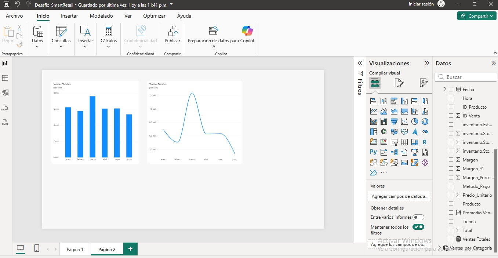
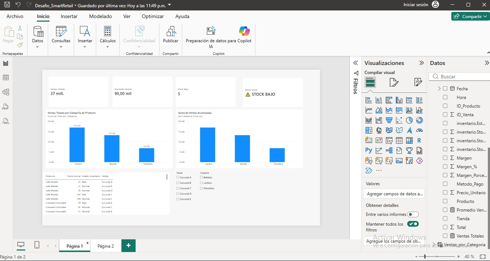

# 📊 Construcción de reportes y dashboard interactivo en Power BI

## 📝 Descripción del proyecto

En este proyecto trabajé con el caso de **SmartRetail**, desarrollando reportes y un dashboard interactivo en **Power BI** para facilitar el análisis de las ventas y del inventario.

El objetivo fue presentar la información de una manera clara y visual, incorporando indicadores, gráficos, filtros y una alerta que permitiera identificar productos con bajo nivel de stock.

---

## 🎯 Objetivos del proyecto

Durante el desarrollo se trabajó principalmente en:

1. 📊 Crear reportes para analizar la información de ventas.
2. 🎛️ Incorporar filtros para facilitar la consulta de los datos.
3. 📅 Utilizar información de fecha para analizar las ventas por período.
4. 📦 Incorporar indicadores relacionados con el inventario.
5. 🚨 Crear una alerta visual para identificar productos con stock bajo.
6. 📈 Construir un dashboard que reuniera la información más importante.

---

## 📊 Construcción de reportes

Se desarrollaron diferentes visualizaciones para analizar los datos de SmartRetail.

Entre ellas:

- 📈 Reportes para visualizar las ventas.
- 🗂️ Análisis de información por categoría.
- 🏪 Filtros por tienda.
- 🎛️ Segmentadores para facilitar la navegación.
- 📅 Visualización de información utilizando fechas y períodos.
- 📋 Tabla con información relevante de los productos.

---

## 📅 Análisis por fecha

Se trabajó con la información temporal para visualizar las ventas en distintos períodos.

Esto permite revisar el comportamiento de los datos a través de los meses y facilita el análisis de la evolución de las ventas.

### 🖼️ Visualización por fecha

🔎 [Ver imagen del reporte por fecha](fecha.jpg)

---

## 📈 Dashboard interactivo

El dashboard reúne diferentes indicadores y visualizaciones para entregar una vista general de la información.

Se incorporaron indicadores como:

- 💰 **Ventas Totales**
- 📊 **Promedio de Ventas**
- 📦 **Stock Bajo**
- 🚨 **Alerta de Stock**

También se utilizaron filtros por **tienda** y **categoría**, permitiendo consultar la información de acuerdo con las necesidades del análisis.

---

## 🚨 Alerta de stock

Se creó una alerta para identificar productos con un nivel de stock menor a **30 unidades**.

Cuando existen productos bajo este nivel, el dashboard permite visualizar una advertencia de **STOCK BAJO**, facilitando la identificación de posibles problemas de inventario.

---

## 📁 Archivos del proyecto

Puedes revisar los archivos desarrollados en este proyecto:

- 📊 [Prueba_SmartRetail.pbix](Prueba_SmartRetail.pbix) — Archivo principal desarrollado en Power BI.
- 📄 [Descripción de los reportes](Descripci%C3%B3n%20de%20los%20reportes.pdf) — Documento con la explicación de los reportes y dashboard.
- 🖼️ [Dashboard final](dashboard.jpg) — Captura del dashboard desarrollado.
- 📅 [Reporte por fecha](fecha.jpg) — Captura de la visualización temporal.

---

## 🛠️ Herramientas utilizadas

- 📊 Microsoft Power BI Desktop
- 🔄 Power Query
- 🧮 DAX
- 🎛️ Segmentadores y filtros
- 📈 Visualizaciones interactivas

---

## 🖼️ Vista del dashboard

🔎 [Ver dashboard en tamaño completo](dashboard.jpg)

---

## 💡 Aprendizaje

Este proyecto me permitió seguir avanzando en el uso de **Power BI**, especialmente en la construcción de reportes y dashboards interactivos.

También pude aplicar filtros, indicadores y alertas para transformar los datos en información más clara y útil para apoyar la toma de decisiones.

---

⭐ **Proyecto desarrollado como parte de mi formación en Análisis de Datos.**
