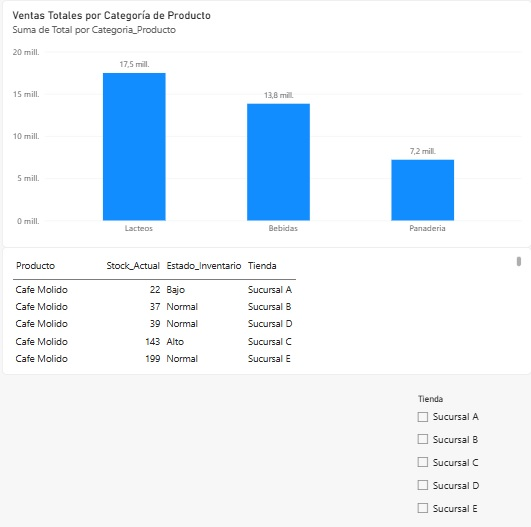

# 📊 Diagnóstico y conexión de fuentes en Power BI

## 📝 Descripción del proyecto

En este desafío trabajé con el caso de **SmartRetail**, una empresa ficticia que necesitaba analizar la información de sus ventas e inventario para apoyar la toma de decisiones.

El objetivo fue conectar diferentes fuentes de datos en **Power BI**, revisar y organizar la información y finalmente crear un dashboard que permitiera visualizar los principales resultados de forma clara y sencilla.

---

## 🎯 Objetivos del desafío

El trabajo se dividió en tres partes principales:

1. 📚 Investigar el concepto de **Business Intelligence (BI)** y comparar Power BI con otras herramientas del mercado.
2. 🔗 Conectar y preparar diferentes fuentes de datos utilizando **Power BI Desktop**.
3. 📊 Crear un dashboard inicial para visualizar información relevante de ventas e inventario.

---

## 🔧 Desarrollo

Para realizar el desafío:

- 📂 Se conectó el archivo de **ventas en formato CSV**.
- 📗 Se conectó el archivo de **inventario en formato Excel**.
- ✏️ Se revisaron y estandarizaron los nombres de las columnas.
- 🔍 Se verificaron y corrigieron los tipos de datos.
- 📊 Se creó un gráfico con las **ventas totales por categoría de producto**.
- 📦 Se incorporó una tabla con los productos, stock actual y estado del inventario.
- 🚦 Se clasificó el inventario según su estado.
- 🎛️ Se agregó un segmentador para facilitar la consulta de la información.
- 🎨 Se organizó el dashboard buscando una presentación clara y fácil de interpretar.

---

## 📁 Archivos del proyecto

Puedes revisar los archivos utilizados y desarrollados en este desafío:

- 📊 [Desafio_SmartRetail.pbix](Desafio_SmartRetail.pbix) — Archivo principal desarrollado en Power BI.
- 📽️ [Desafio_SmartRetail.pptx](Desafio_SmartRetail.pptx) — Presentación sobre Business Intelligence y Power BI.
- 📄 [Desarrollo del Dashboard SmartRetail.pdf](Desarrollo%20del%20Dashboard%20SmartRetail.pdf) — Documento explicativo del desarrollo.
- 🖼️ [Desafio_SmartRetail.jpg](Desafio_SmartRetail.jpg) — Captura del dashboard final.

---

## 🛠️ Herramientas utilizadas

- 📊 Microsoft Power BI Desktop
- 🔄 Power Query
- 📗 Microsoft Excel
- 📄 Archivos CSV
- 📽️ PowerPoint

---

## 📈 Resultado final

Como resultado se obtuvo un dashboard que permite visualizar información relevante de **SmartRetail**, facilitando el análisis de las ventas y del inventario.

El dashboard permite:

- 📊 Visualizar las ventas totales por categoría.
- 📦 Consultar el stock actual de los productos.
- 🚦 Identificar el estado del inventario.
- 🎛️ Filtrar la información mediante segmentadores.
- 🔎 Consultar los datos de una manera más clara y ordenada.

---

## 🖼️ Vista del dashboard

---

## 💡 Aprendizaje

Este desafío me permitió practicar la conexión de distintas fuentes de datos, la preparación de información en Power BI y la creación de visualizaciones para presentar los datos de una manera más clara y útil para la toma de decisiones.

---

⭐ **Proyecto desarrollado como parte de mi formación en Análisis de Datos.**
