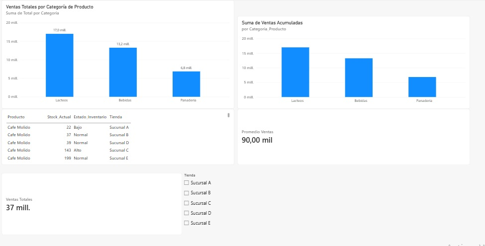

# 📊 Preparación y modelado de datos en Power BI

## 📝 Descripción del proyecto

En este desafío continué trabajando con el caso de **SmartRetail**, avanzando desde la conexión de datos hacia una etapa de preparación, transformación y modelado de la información.

El objetivo fue trabajar los datos utilizando **Power Query y Power BI**, construir relaciones entre las tablas y utilizar **DAX** para generar nuevos cálculos que permitieran mejorar el análisis de la información.

---

## 🎯 Objetivos del desafío

El trabajo se dividió en tres etapas principales:

1. 🧹 Preparar y transformar los datos utilizando **Power Query**.
2. 🔗 Construir un **modelo de datos relacional** con relaciones funcionales.
3. 🧮 Crear **medidas, columnas y tablas calculadas con DAX** para obtener indicadores útiles para el análisis.

---

## 🧹 Transformación y limpieza de datos

Durante la preparación de los datos se realizaron diferentes tareas:

- ✏️ Revisión y modificación de nombres y tipos de columnas.
- 🔍 Revisión de valores nulos o incorrectos.
- 📊 Filtrado de las ventas para considerar productos con ventas mayores a **10 unidades**.
- 🔄 Combinación de las tablas de **ventas e inventario**.
- 🛠️ Preparación de los datos mediante **Power Query**.

---

## 🔗 Modelado de datos

Se trabajó en la construcción de un modelo que permitiera relacionar correctamente la información.

Para esto:

- 🔑 Se utilizaron campos clave para relacionar las tablas.
- 🔗 Se establecieron relaciones activas entre las tablas.
- 📋 Se organizó la información para facilitar el análisis de ventas e inventario.
- 📊 Se trabajó con tablas de hechos y dimensiones para estructurar el modelo.

### 🖼️ Modelo de relaciones

🔎 [Ver imagen de las relaciones](relaciones%20construidas.jpg)

---

## 🧮 Cálculos DAX

Como parte del desafío se utilizaron cálculos DAX para ampliar el análisis de los datos.

Se trabajó con:

- 📦 Una columna calculada para clasificar el estado del stock.
- 💰 Una medida para calcular las **ventas totales**.
- 📈 Una medida para obtener el **promedio de ventas**.
- 📋 Una tabla calculada para analizar las ventas por categoría.
- 📊 Visualizaciones para presentar los resultados obtenidos.

---

## 📁 Archivos del proyecto

Puedes revisar los archivos desarrollados en este desafío:

- 📊 [Desafio_SmartRetail.pbix](Desafio_SmartRetail.pbix) — Archivo principal desarrollado en Power BI.
- 📄 [Descripción del procedimiento](descripci%C3%B3n%20del%20procedimiento.pdf) — Explicación del proceso realizado.
- 🔗 [Relaciones construidas](relaciones%20construidas.jpg) — Imagen del modelo y sus relaciones.
- 🖼️ [Dashboard final](dashboard.jpg) — Captura del resultado desarrollado en Power BI.

---

## 🛠️ Herramientas utilizadas

- 📊 Microsoft Power BI Desktop
- 🔄 Power Query
- 🧮 DAX
- 📗 Microsoft Excel
- 📄 Archivos CSV

---

## 📈 Resultado final

Como resultado se obtuvo un modelo de datos que permite analizar de forma más organizada la información de **ventas e inventario de SmartRetail**.

A través de Power Query se prepararon los datos, se establecieron relaciones entre las tablas y se incorporaron cálculos DAX para obtener nuevos indicadores y utilizarlos en las visualizaciones.

---

## 🖼️ Vista del dashboard

🔎 [Ver dashboard en tamaño completo](dashboard.jpg)

---

## 💡 Aprendizaje

Este desafío me permitió profundizar en el uso de **Power Query**, comprender mejor la importancia de las relaciones entre tablas y comenzar a utilizar **DAX** para crear medidas y cálculos que aportan información útil al análisis de datos.

---

⭐ **Proyecto desarrollado como parte de mi formación en Análisis de Datos.**
